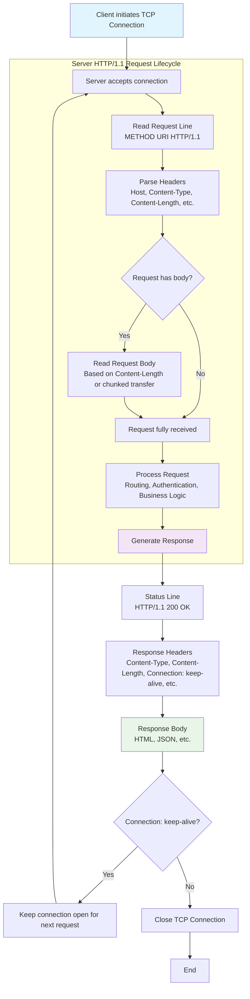
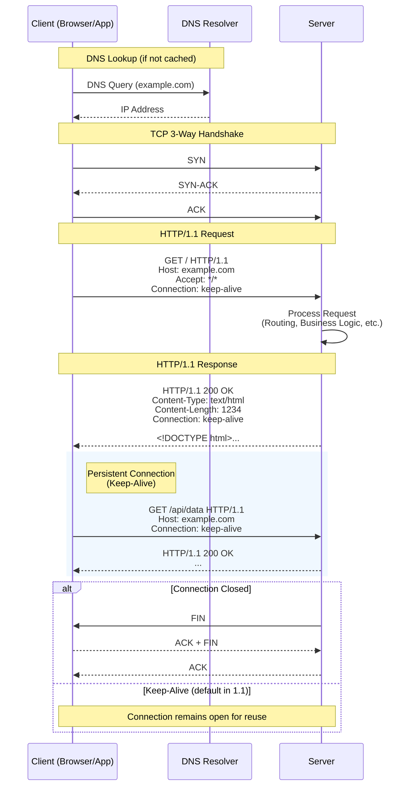

# HyperText Transfer Protocol (HTTP)

## Server

```mermaid
flowchart TD
    A[Client initiates TCP Connection] --> B[Server accepts connection]

    subgraph Server HTTP/1.1 Request Lifecycle
        B --> C[Read Request Line\nMETHOD URI HTTP/1.1]
        C --> D[Parse Headers\nHost, Content-Type, Content-Length, etc.]
        D --> E{Request has body?}
        E -->|Yes| F[Read Request Body\nBased on Content-Length or chunked transfer]
        E -->|No| G[Request fully received]
        F --> G

        G --> H[Process Request\nRouting, Authentication, Business Logic]
        H --> I[Generate Response]
    end

    I --> J[Status Line\nHTTP/1.1 200 OK]
    J --> K[Response Headers\nContent-Type, Content-Length, Connection: keep-alive, etc.]
    K --> L[Response Body\nHTML, JSON, etc.]

    L --> M{Connection: keep-alive?}
    M -->|Yes| N[Keep connection open for next request]
    M -->|No| O[Close TCP Connection]

    N --> B
    O --> End[End]

    style A fill:#e1f5fe
    style I fill:#f3e5f5
    style L fill:#e8f5e8
```
---
## Client

```mermaid
sequenceDiagram
    participant C as Client (Browser/App)
    participant DNS as DNS Resolver
    participant S as Server

    %% Optional DNS Lookup
    Note over C,DNS: DNS Lookup (if not cached)
    C->>DNS: DNS Query (example.com)
    DNS-->>C: IP Address

    %% TCP Connection Establishment
    Note over C,S: TCP 3-Way Handshake
    C->>S: SYN
    S-->>C: SYN-ACK
    C->>S: ACK

    %% HTTP Request
    Note over C,S: HTTP/1.1 Request
    C->>S: GET / HTTP/1.1<br>Host: example.com<br>Accept: */*<br>Connection: keep-alive

    %% Server Processing
    S->>S: Process Request<br>(Routing, Business Logic, etc.)

    %% HTTP Response
    Note over C,S: HTTP/1.1 Response
    S-->>C: HTTP/1.1 200 OK<br>Content-Type: text/html<br>Content-Length: 1234<br>Connection: keep-alive<br><br><!DOCTYPE html>...

    %% Optional: Multiple requests over same connection (HTTP/1.1 persistent)
    rect rgb(240, 248, 255)
    Note right of C: Persistent Connection<br>(Keep-Alive)
    C->>S: GET /api/data HTTP/1.1<br>Host: example.com<br>Connection: keep-alive
    S-->>C: HTTP/1.1 200 OK<br>...
    end

    %% Connection Close (optional)
    alt Connection Closed
        S->>C: FIN
        C-->>S: ACK + FIN
        S-->>C: ACK
    else Keep-Alive (default in 1.1)
        Note over C,S: Connection remains open for reuse
    end
```
