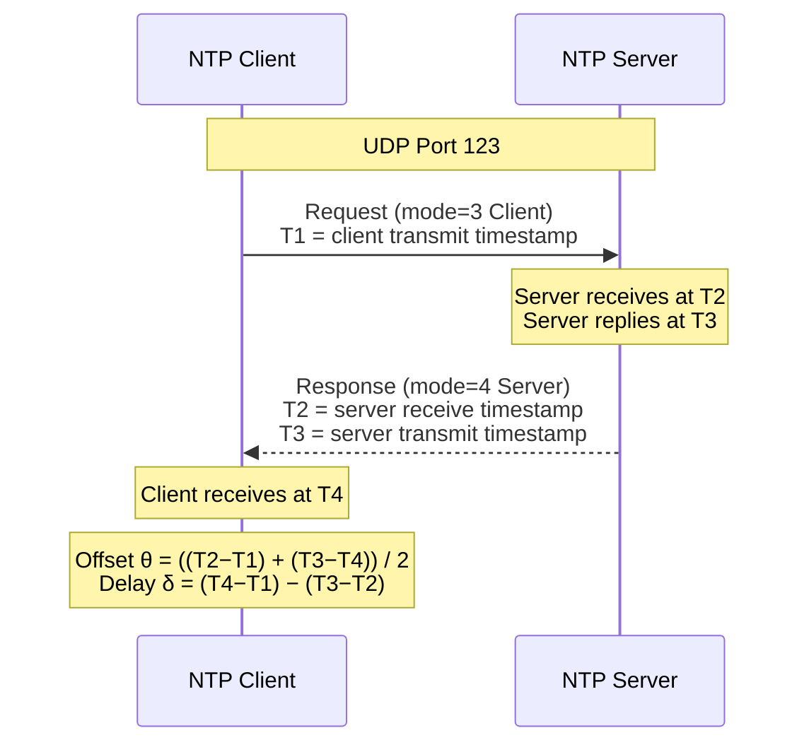
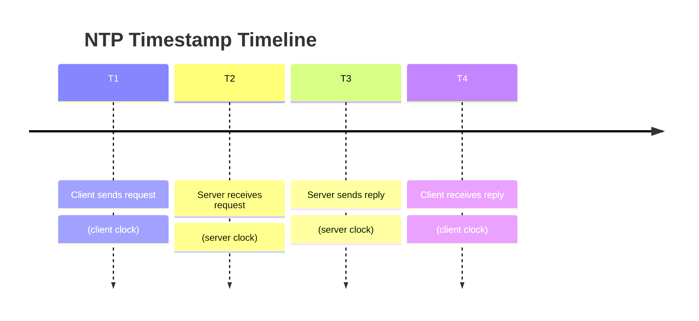
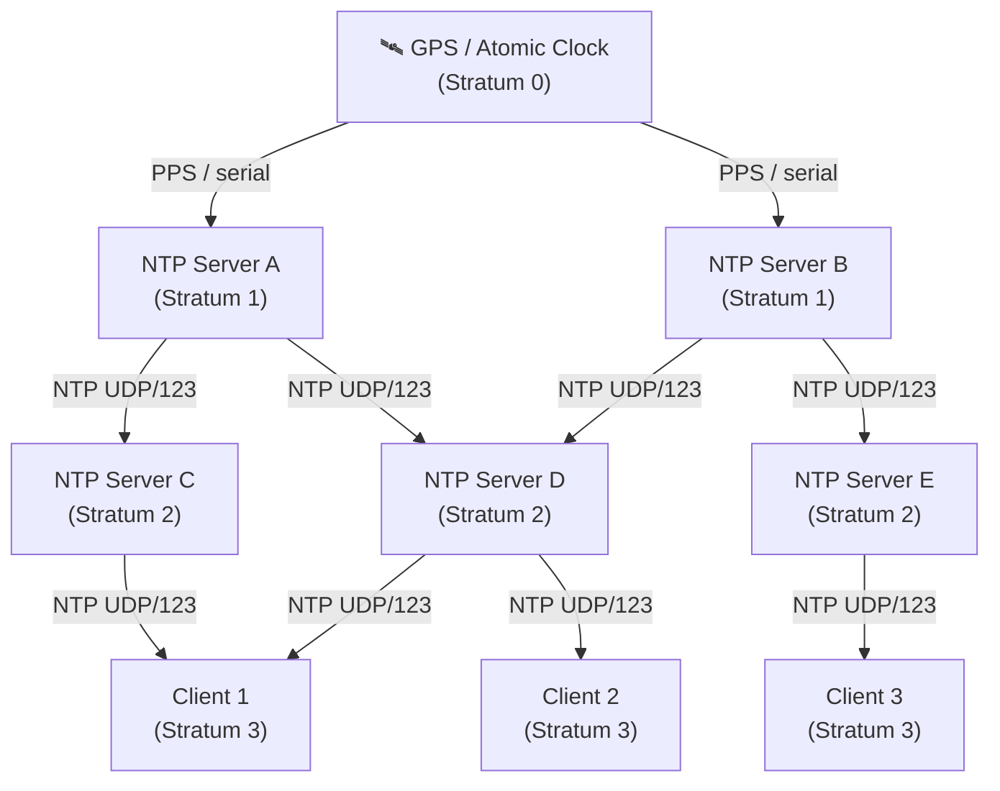
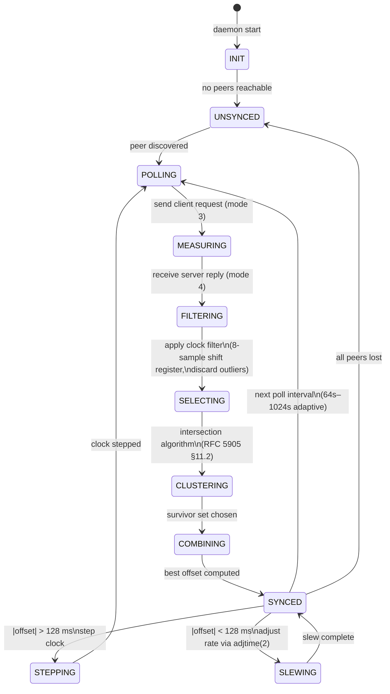
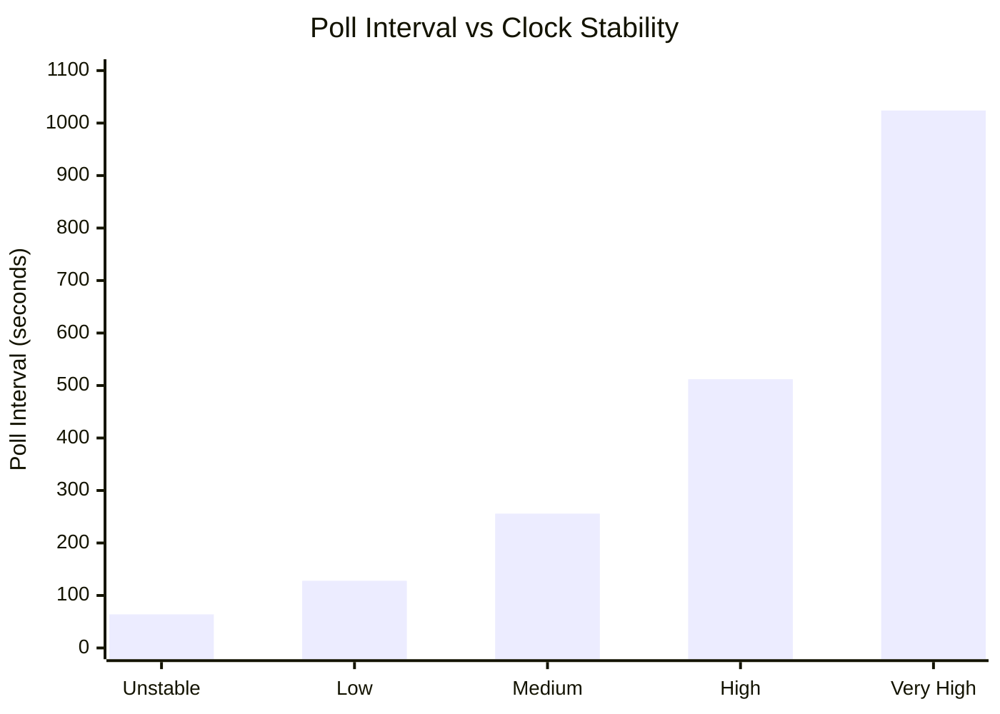
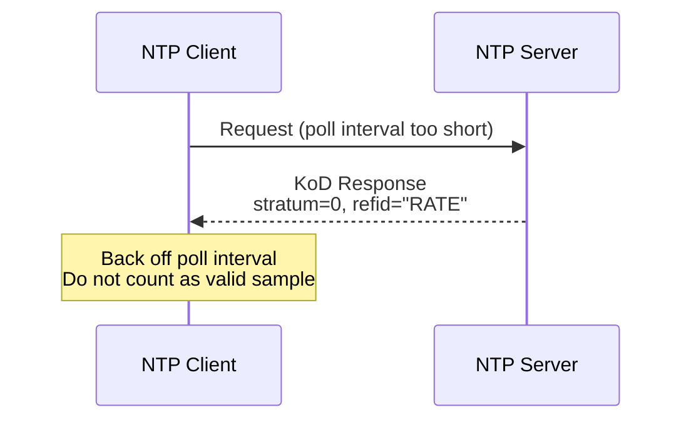
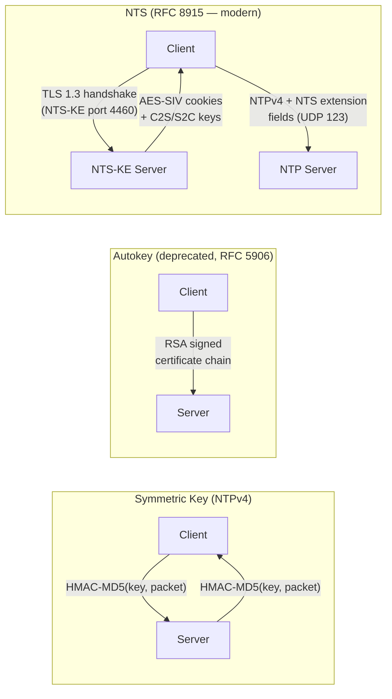

# Network Time Protocol (NTP)

## Overview

NTP (Network Time Protocol, RFC 5905) synchronizes clocks across a network to within a few milliseconds of UTC. It operates over UDP port 123 and uses a hierarchical system of time sources called **strata**.

---

## Stratum Hierarchy

| Stratum | Description |
|---------|-------------|
| 0 | Reference clocks (GPS, atomic, radio) — not on the network |
| 1 | Primary servers directly connected to stratum-0 devices |
| 2 | Servers synchronized to stratum-1 |
| 3–15 | Each level syncs from the level above |
| 16 | Unsynchronized / unreachable |

---

## Packet Exchange Flow



---

## Four NTP Timestamps Explained



### Derived Metrics

| Metric | Formula | Meaning |
|--------|---------|---------|
| **Round-trip delay** δ | `(T4 − T1) − (T3 − T2)` | Total network latency |
| **Clock offset** θ | `((T2 − T1) + (T3 − T4)) / 2` | How far client clock is from server |

The client adjusts its clock by θ. If |θ| is large (> 128 ms by default), `ntpd` **steps** the clock immediately; otherwise it **slews** (gradually adjusts) the clock rate.

---

## Full Stratum Synchronization Flow



---

## NTP Operating Modes



---

## Poll Interval Backoff

NTP uses an adaptive poll interval (MINPOLL=6 → 64 s, MAXPOLL=10 → 1024 s by default). The interval increases exponentially when the clock is stable and decreases when jitter is detected.



---

## Kiss-o'-Death (KoD) Packets

If a server wants to throttle or reject a client, it responds with **stratum 0** and a 4-character ASCII code in the reference ID field:

| Code | Meaning |
|------|---------|
| `DENY` | Client access denied |
| `RSTR` | Client access restricted |
| `RATE` | Client polling too fast |
| `STEP` | Accept the KoD, step clock |



---

## NTPv4 Packet Structure

```
 0                   1                   2                   3
 0 1 2 3 4 5 6 7 8 9 0 1 2 3 4 5 6 7 8 9 0 1 2 3 4 5 6 7 8 9 0 1
+-+-+-+-+-+-+-+-+-+-+-+-+-+-+-+-+-+-+-+-+-+-+-+-+-+-+-+-+-+-+-+-+
|LI | VN  |Mode |    Stratum    |     Poll      |   Precision   |
+-+-+-+-+-+-+-+-+-+-+-+-+-+-+-+-+-+-+-+-+-+-+-+-+-+-+-+-+-+-+-+-+
|                          Root Delay                           |
+-+-+-+-+-+-+-+-+-+-+-+-+-+-+-+-+-+-+-+-+-+-+-+-+-+-+-+-+-+-+-+-+
|                       Root Dispersion                         |
+-+-+-+-+-+-+-+-+-+-+-+-+-+-+-+-+-+-+-+-+-+-+-+-+-+-+-+-+-+-+-+-+
|                     Reference Identifier                      |
+-+-+-+-+-+-+-+-+-+-+-+-+-+-+-+-+-+-+-+-+-+-+-+-+-+-+-+-+-+-+-+-+
|                   Reference Timestamp (64)                    |
|                                                               |
+-+-+-+-+-+-+-+-+-+-+-+-+-+-+-+-+-+-+-+-+-+-+-+-+-+-+-+-+-+-+-+-+
|                   Originate Timestamp (64)                    |  ← T1
|                                                               |
+-+-+-+-+-+-+-+-+-+-+-+-+-+-+-+-+-+-+-+-+-+-+-+-+-+-+-+-+-+-+-+-+
|                    Receive Timestamp (64)                     |  ← T2
|                                                               |
+-+-+-+-+-+-+-+-+-+-+-+-+-+-+-+-+-+-+-+-+-+-+-+-+-+-+-+-+-+-+-+-+
|                    Transmit Timestamp (64)                    |  ← T3/T4
|                                                               |
+-+-+-+-+-+-+-+-+-+-+-+-+-+-+-+-+-+-+-+-+-+-+-+-+-+-+-+-+-+-+-+-+
|                 Key Identifier (optional) (32)                |
+-+-+-+-+-+-+-+-+-+-+-+-+-+-+-+-+-+-+-+-+-+-+-+-+-+-+-+-+-+-+-+-+
|                 Message Digest (optional) (128)               |
|                                                               |
|                                                               |
|                                                               |
+-+-+-+-+-+-+-+-+-+-+-+-+-+-+-+-+-+-+-+-+-+-+-+-+-+-+-+-+-+-+-+-+
```

| Field | Bits | Description |
|-------|------|-------------|
| LI | 2 | Leap Indicator (0=ok, 1=+1s, 2=−1s, 3=unsync) |
| VN | 3 | Version Number (4) |
| Mode | 3 | 1=sym-active, 2=sym-passive, 3=client, 4=server, 5=broadcast |
| Stratum | 8 | Clock stratum (0=KoD, 1=primary, 2–15=secondary) |
| Poll | 8 | Log₂ of poll interval in seconds |
| Precision | 8 | Log₂ of clock precision in seconds (signed) |
| Root Delay | 32 | Round-trip delay to stratum-1 (NTP short format) |
| Root Dispersion | 32 | Max error from primary source |
| Reference ID | 32 | Stratum-1: 4-char ASCII; Stratum≥2: IPv4 of upstream |

---

## Security: NTP Authentication



**NTS (Network Time Security)** is the current recommended approach — it provides authenticated, replay-protected NTP without requiring pre-shared keys by bootstrapping from TLS.

---

## References

- [RFC 5905](https://datatracker.ietf.org/doc/html/rfc5905) — NTPv4 Specification  
- [RFC 8915](https://datatracker.ietf.org/doc/html/rfc8915) — Network Time Security (NTS)  
- [RFC 5906](https://datatracker.ietf.org/doc/html/rfc5906) — NTP Autokey (deprecated)  
- [ntppool.org](https://www.ntppool.org/) — Public NTP Pool Project
