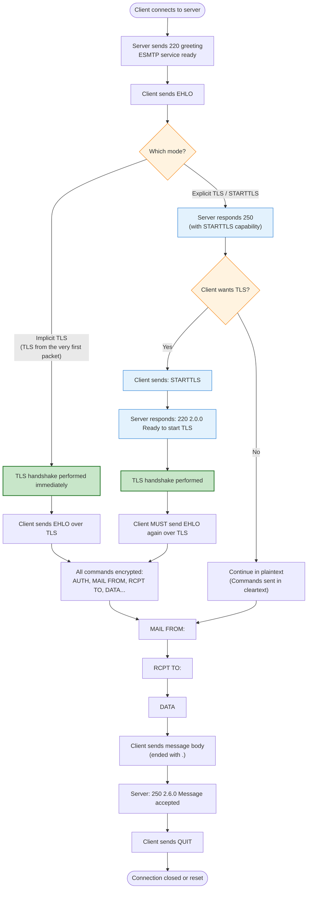

# SMTP

```mermaid
flowchart TD
    Start([Client connects to server]) 
    --> Greeting["Server sends 220 greeting\nESMTP service ready"]

    Greeting --> EHLO1["Client sends EHLO"]

    EHLO1 --> CheckMode{Which mode?}

    %% Implicit TLS branch (e.g. port 465 - SMTPS)
    CheckMode -- Implicit TLS<br/>(TLS from the very first packet) --> ImplicitTLS["TLS handshake performed immediately"]
    ImplicitTLS --> SecureEHLO1["Client sends EHLO over TLS"]
    SecureEHLO1 --> SecureFlow["All commands encrypted:\nAUTH, MAIL FROM, RCPT TO, DATA..."]

    %% Explicit TLS / STARTTLS branch (e.g. port 25 or 587)
    CheckMode -- Explicit TLS / STARTTLS --> Advertise["Server responds 250\n(with STARTTLS capability)"]

    Advertise --> ClientDecide{Client wants TLS?}

    ClientDecide -- No --> PlainFlow["Continue in plaintext\n(Commands sent in cleartext)"]

    ClientDecide -- Yes --> StartTLS["Client sends: STARTTLS"]
    StartTLS --> Ready["Server responds: 220 2.0.0 Ready to start TLS"]
    Ready --> TLSHandshake["TLS handshake performed"]
    TLSHandshake --> SecureEHLO2["Client MUST send EHLO again over TLS"]
    SecureEHLO2 --> SecureFlow

    %% Common encrypted or plaintext flow continues here
    SecureFlow & PlainFlow --> MAIL["MAIL FROM:<sender>"]
    MAIL --> RCPT["RCPT TO:<recipient>"]
    RCPT --> DATA["DATA"]
    DATA --> Body["Client sends message body\n(ended with <CRLF>.<CRLF>)"]
    Body --> Accept["Server: 250 2.6.0 Message accepted"]
    Accept --> Quit["Client sends QUIT"]
    Quit --> End([Connection closed or reset])

    %% Styling
    classDef implicit fill:#c8e6c9,stroke:#2e7d32,stroke-width:2px
    classDef explicit fill:#e3f2fd,stroke:#1976d2
    classDef decision fill:#fff3e0,stroke:#f57c00

    class ImplicitTLS,TLSHandshake implicit
    class CheckMode,ClientDecide decision
    class Advertise,StartTLS,Ready explicit
```
