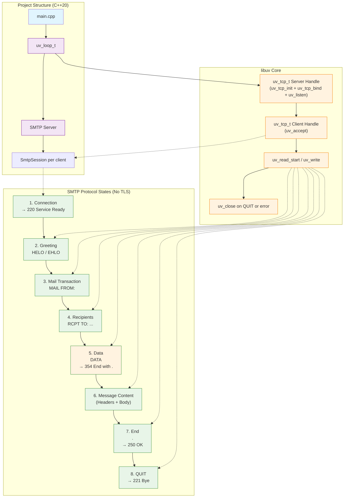
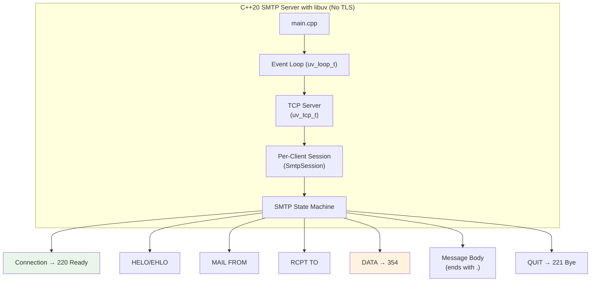

# SMTP

Here's the **fixed Mermaid diagram**. The parse error was caused by unquoted node labels containing parentheses `()` and special characters — Mermaid requires quotes around such text.

### Alternative: Cleaner Version (Recommended)

If you prefer even simpler labels:

