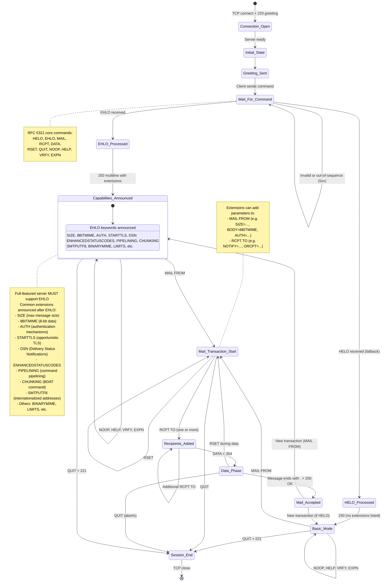

# SMTP
Here is an updated **Mermaid** class diagram (with state elements) that incorporates the **capabilities and extensions** of a full-featured **SMTP server** as defined in **RFC 5321** and related ESMTP standards.

It shows the core states from the previous diagram while adding a dedicated section for **Server Capabilities** announced via **EHLO** and common **SMTP Service Extensions**.

### Capabilities and Extensions Explained (RFC 5321 + ESMTP)

**Core Requirement (RFC 5321)**:
- Every modern SMTP server **MUST** support the **EHLO** command.
- Upon successful EHLO, the server returns a multiline 250 response listing its domain followed by supported **EHLO keywords** (service extensions).
- **HELO** is still supported as a fallback for legacy clients (no extensions listed).

**Common SMTP Service Extensions** (announced as EHLO keywords):

| Extension Keyword       | Description                                                                 | RFC Reference      | Typical Use / Benefit                          |
|-------------------------|-----------------------------------------------------------------------------|--------------------|------------------------------------------------|
| SIZE                   | Declares maximum message size the server accepts                           | RFC 1870          | Prevents oversized messages                    |
| 8BITMIME               | Supports transmission of 8-bit data (no 7-bit conversion needed)           | RFC 6152          | Efficient MIME/binary content                  |
| AUTH                   | SMTP Authentication (PLAIN, LOGIN, CRAM-MD5, etc.)                         | RFC 4954          | Secure client authentication                   |
| STARTTLS               | Opportunistic TLS encryption upgrade                                       | RFC 3207          | Encrypts the session after negotiation         |
| DSN                    | Delivery Status Notifications                                              | RFC 3461          | Detailed bounce and delivery reports           |
| ENHANCEDSTATUSCODES    | Enhanced (more detailed) status codes in replies                           | RFC 3463          | Better error diagnosis                         |
| PIPELINING             | Allows multiple commands in one TCP packet (faster)                        | RFC 2920          | Performance improvement                        |
| CHUNKING               | Binary chunked data transfer with BDAT command                             | RFC 3030          | Large message efficiency                       |
| SMTPUTF8               | Internationalized email (UTF-8 addresses and headers)                      | RFC 6531          | Non-ASCII email support                        |
| BINARYMIME             | Full binary MIME transport (with CHUNKING)                                 | RFC 3030          | True binary data without encoding              |
| LIMITS                 | Declares server limits (e.g., max RCPT, max MAIL)                          | RFC 9422          | Helps clients avoid hitting limits             |

**How Extensions Work**:
- After EHLO, the client knows exactly what the server supports.
- Some extensions add **parameters** to existing commands (e.g., `MAIL FROM:<sender> SIZE=12345 BODY=8BITMIME`).
- Extensions can also introduce new commands (e.g., `AUTH`, `STARTTLS`, `BDAT` for CHUNKING).
- A full-featured server typically offers most of the above, depending on configuration and security policy.

**Implementation Notes for a Full-Featured RFC 5321 Server**:
- Must reply with 250 for supported extensions.
- Must gracefully handle unknown extensions (ignore parameters it does not support).
- Security best practice: Offer **STARTTLS** before **AUTH** and require TLS for authentication when possible.
- The server must still fully support the base protocol even if no extensions are enabled.

